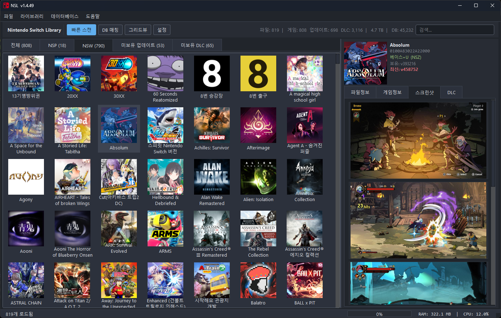

<h1>Nintendo Switch Library (NSL)</h1>

**PC에 저장된 닌텐도 스위치 게임 파일(NSP, NSZ, XCI, XCZ)을 스캔하고,  관련 메타데이터 및 에셋(아이콘, 스크린샷)을 자동으로 수집하여 관리하는 데스크톱 GUI 애플리케이션입니다.**

복잡한 설치 과정 없이 제공되는 **단일 실행 파일(**`nsl.exe`**)** 하나로 간편하게 사용할 수 있습니다.

> 한국어 Windows 전용 프로그램입니다.

---

---

## 주요 기능

### 다양한 포맷 지원 및 스캔
`NSP`, `NSZ`, `XCI`, `XCZ` 파일을 지원하며, 지정된 디렉토리를 스캔하여 게임 목록을 구성합니다. 최대 5개의 스캔 디렉토리를 동시에 관리할 수 있습니다.

### 정밀한 메타데이터 분석
파일 헤더(CNMT, 티켓, XML 등)와 내장된 분석 엔진을 이용한 딥 스캔을 통해 게임의 타이틀 ID, 버전, 콘텐츠 타입(Base, Update, DLC)을 정확하게 추출합니다. 같은 디렉토리에 있는 베이스/업데이트/DLC 파일을 자동으로 그룹화하여 보유 버전과 최신 버전을 비교 표시합니다.

### 에셋 자동 추출 및 다운로드
* 게임 파일 내부에서 아이콘을 자동으로 추출하여 표시합니다.
* TitleDB와 연동하여 게임 설명과 스크린샷을 다운로드하고 갤러리 형태로 제공합니다.
* 게임 설명을 **Google Translate**로 한국어로 자동 번역할 수 있습니다.

### TitleDB 연동
최신 타이틀 정보(버전, 한국어 이름, 설명 등)를 온라인(`tinfoil`, `blawar` 데이터베이스)에서 다운로드하여 로컬 DB를 갱신합니다.

### 탭별 필터 보기
폴더별 탭 외에도 **미보유 업데이트**, **미보유 DLC** 탭을 자동으로 제공하여 어떤 콘텐츠가 부족한지 한눈에 확인할 수 있습니다.

### 편리한 파일 관리
GUI 내에서 바로 게임 실행, 폴더 열기, 경로 복사, 파일 이름 변경(자동 포맷팅 지원)을 할 수 있습니다. 외부 런처(에뮬레이터)를 지정해서 우클릭 한 번으로 실행도 가능합니다.

### NSZ/XCZ 자동 압축 해제
설정에서 활성화하면 압축된 게임 파일을 실행 시 자동으로 NSP/XCI로 풀어서 열어줍니다. (별도의 `nsz` 도구 경로 지정 필요)

### CSV 내보내기
현재 보고 있는 라이브러리 목록을 CSV 파일로 내보낼 수 있습니다.

### 고성능 캐싱 시스템
한 번 스캔한 파일은 해시와 수정 시간을 기반으로 캐싱하여 다음 스캔 시 속도를 대폭 향상시킵니다. **빠른 스캔**(증분 스캔) 기능으로 변경된 파일만 재분석합니다.

### 14가지 테마
GitHub Dark/Light, Catppuccin Mocha, Dracula, One Dark, Tokyo Night, Nord, Solarized Dark, Gruvbox Dark, Ayu Dark, Monokai, Cyberpunk Neon, Rosé Pine, Material Ocean 중에서 선택할 수 있습니다.

---

## 시스템 요구사항 및 준비물

> [!IMPORTANT]
> 본 프로그램을 정상적으로 사용하기 위해서는 펌웨어 키 파일이 **반드시** 필요합니다.

### `prod.keys` 파일
* 닌텐도 스위치의 펌웨어 키 파일입니다.
* **위치**: 프로그램 실행 파일(`nsl.exe`)과 **동일한 폴더**에 `prod.keys`라는 이름으로 배치해 주세요.
* *이 파일이 없으면 암호화된 게임 파일(NSP, XCI 내부 데이터)에서 아이콘이나 상세 타이틀 정보를 추출할 수 없으며, 보유 버전이 0으로 표시될 수 있습니다.*

> **참고**: 소스 코드로 직접 실행할 경우 `Python 3.8` 이상 및 `PySide6`, `Pillow`, `psutil`, `pycryptodome`, `deep-translator` 라이브러리가 필요합니다.

---

## 사용 방법

### 1. 프로그램 실행
`prod.keys` 파일이 같은 폴더에 있는지 확인한 후, 배포된 실행 파일(`nsl.exe`)을 더블 클릭하여 실행합니다.

### 2. 타이틀 DB 다운로드
상단 메뉴의 **[데이터베이스] > [타이틀 DB 다운로드]**를 클릭하여 최신 게임 메타데이터를 받아옵니다. *(한국어 이름 및 설명, 최신 버전 정보 포함)*

### 3. 스캔 폴더 추가 및 스캔
1. **[설정] > [스캔 폴더]**에서 스위치 게임 파일이 모여있는 폴더를 추가합니다. *(최대 5개)*
2. 상단의 **[빠른 스캔]** 버튼(또는 `F5`)을 눌러 파일 분석을 시작합니다. 처음에는 **[라이브러리] > [전체 스캔]**으로 한 번 풀스캔하시는 것을 권장합니다.
3. 스캔이 완료되면 우측 패널에서 상세 정보, 아이콘, 스크린샷을 확인할 수 있습니다.

### 4. 게임 우클릭 메뉴
* 🎮 실행 — 지정한 외부 런처로 게임 실행
* 📂 폴더에서 열기 — 탐색기에서 해당 파일 위치 열기
* 📄 경로 복사 — 파일 경로를 클립보드로 복사
* 📸 스크린샷 다운로드 — 선택한 게임의 스크린샷 받기
* 🖼 아이콘 스캔 — 선택한 게임의 아이콘 추출

---

## 단축키

| 키 | 동작 |
|---|---|
| `F5` | 빠른 스캔 |
| `Ctrl + F` | 검색창 포커스 |
| `Ctrl + O` | 설정 열기/닫기 |
| `Esc` | 검색어 초기화 |
| `Enter` | 선택한 파일 실행 |
| 우클릭 | 컨텍스트 메뉴 |
| `Alt + F4` | 종료 |

---

## 메뉴 구성

* **파일** — CSV 내보내기, 종료
* **라이브러리** — 전체 스캔, 빠른 스캔, 스캔 중지, 캐시 현황, 더미 데이터 정리, 라이브러리 초기화
* **데이터베이스** — 타이틀 DB 다운로드/매칭/현황, 전체 아이콘 스캔, 전체 스크린샷 다운로드, 타이틀 DB 초기화
* **도움말** — 업데이트 확인, 단축키, 정보

---

## 문제 해결 (Troubleshooting)

<b>Q. 아이콘이 나오지 않거나 '미확인'으로 뜹니다.</b>

 

> **A.** `prod.keys` 파일이 프로그램과 같은 폴더에 있는지 확인해 주세요. 키 파일이 없거나 구버전일 경우 최신 게임의 데이터를 읽지 못할 수 있습니다.

<b>Q. 보유 버전이 0으로 표시됩니다.</b>

 

> **A.** 같은 디렉토리에 베이스(`*0000`)와 업데이트(`*0800`) NSP가 모두 있는데도 보유 버전이 0으로 나온다면, 최신 버전에서 수정된 인코딩 이슈일 수 있습니다. 최신 빌드로 업데이트 후 **[라이브러리] > [라이브러리 초기화]**로 캐시를 비우고 다시 스캔해 주세요.

<b>Q. DB 갱신 시 에러가 발생합니다.</b>

 

> **A.** 만약 이전 버전에서 업데이트한 경우, 프로그램 폴더 내의 `library.db` 파일을 삭제한 뒤 프로그램을 재실행하여 DB 스키마를 초기화해 보세요.

<b>Q. 스크린샷이 안 보입니다.</b>

 

> **A.** 목록에서 게임을 우클릭한 뒤 **[스크린샷 다운로드]**를 클릭하거나, 상단 메뉴의 **[데이터베이스] > [전체 스크린샷 다운로드]**를 이용해 주세요.

<b>Q. NSZ/XCZ 파일을 실행할 수 없습니다.</b>

 

> **A.** NSZ/XCZ는 압축된 포맷이라 대부분의 에뮬레이터에서 직접 열 수 없습니다. **[설정] > [실행 프로그램]**에서 NSZ 자동 압축 해제를 활성화하고 `nsz.exe` 경로를 지정하면, 실행 시 자동으로 NSP/XCI로 풀어서 열어줍니다.

